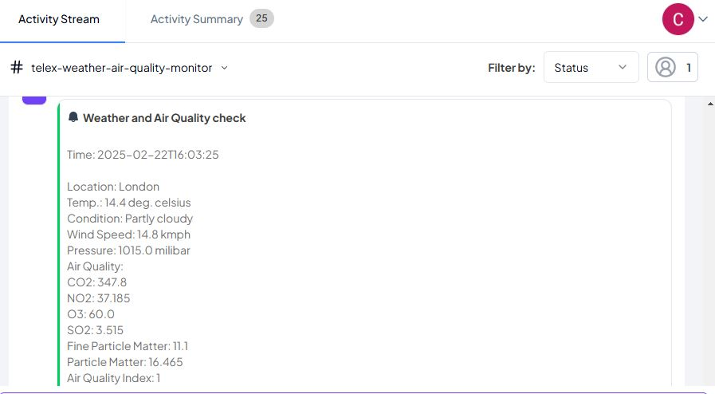

# Weather and Air Quality Monitor

## Overview
This FastAPI-based application monitors weather conditions and air quality for a specified location. It fetches weather data using [The Weather API](https://www.weatherapi.com/) service and sends updates to a specified endpoint. The service supports background tasks for handling requests asynchronously.

## Features
- Monitors weather conditions (temperature, wind speed, pressure, etc.).
- Monitors air quality (CO2, NO2, O3, SO2, PM2.5, PM10, AQI, etc.).
- Uses background tasks for non-blocking request handling.
- Supports CORS for cross-origin requests.

## Installation
1. Clone the repository:
   ```bash
   git clone https://github.com/telexintegrations/telex_weather_air_quality_integration-HNG12_Stage_3.git
   cd telex_weather_air_quality_integration-HNG12_Stage_3
   ```
2. Create a virtual environment:
   ```bash
   python -m venv venv
   source venv/bin/activate  # On Windows use: venv\Scripts\activate
   ```
3. Install dependencies:
   ```bash
   pip install -r requirements.txt
   ```
4. Set up environment variables:
   Create a `.env` file in the project root and add:
   ```env
   API_KEY=your_weather_api_key
   ```

## Running the Application
Start the FastAPI application using Uvicorn:
```bash
uvicorn main:app --reload
```

## API Endpoints
### 1. Get Integration Details
**Endpoint:** `GET /integration.json`

**Description:** Returns metadata about the integration.

**Response:**
```json
{
  "data": {
    "descriptions": {
      "app_name": "Weather and Air Quality Monitor",
      "app_description": "A Weather and Air Quality Monitor for a Specific Location",
      "app_logo": "<image_url>",
      "app_url": "http://localhost:8000",
      "background_color": "#fff"
    },
    "settings": [
      { "label": "location", "type": "text", "required": true, "default": "london" },
      { "label": "interval", "type": "text", "required": true, "default": "* * * * *" }
    ]
  }
}
```

### 2. Trigger Weather Monitor
**Endpoint:** `POST /tick`

**Description:** Triggers a background task to fetch weather data and send a message to the return URL.

**Request Body:**
```json
{
  "channel_id": "test_channel",
  "return_url": "http://example.com/return",
  "settings": [
    { "label": "location", "type": "text", "required": true, "default": "london" }
  ]
}
```

**Response:**
```json
{ "status": "accepted" }
```
## Telex Integration Setup
### Step 1: Create Telex Channel
- Log into your Telex account
- Click on the ⊕ sign to add new channel
- Fill in channel details:
  - Name: "Weather and Air Quality Monitor"

### Step 2: Add Integration to Channel
In the left menu on your Telex dashboard:
- Click "Apps"
- Click "Add New"
- Enter the Integration JSON URL: `https://your-domain/integration.json`

### Step 2: Configure Integration
- Click on "Manage App" beside the added integration
- Click on "Settings"
- Replace defaults in `location` (london) and `interval` (0  * * * * - cron value for 1 hour) fields with custom values if necessary.

### Step 3: Save and Activate
- Click "Save Settings"
- Enable the integration on the Apps dashboard
- You should be able to see weather info in your channel after set interval time

**Message:**
```
Time: 2025-02-22T17:03:10

Location: London
Temp.: 13.0 deg. celsius
Condition: Partly cloudy
Wind Speed: 11.9 kmph
Pressure: 1016.0 milibar
Air Quality:
CO2: 368.15
NO2: 53.28
O3: 53.0
SO2: 4.995
Fine Particle Matter: 12.21
Particle Matter: 20.535
Air Quality Index: 1
```

## Screenshots




## Testing
Run unit tests using `pytest`:
```bash
pytest
```
Tests include:
- Checking the `/integration.json` response.
- Mocking external API calls using `pytest-mock`.
- Validating the `/tick` endpoint and background task handling.

## Contributing
To contribute to the project:

1. Fork the repository
2. Create a feature branch
3. Commit changes
4. Push to your branch
5. Submit a Pull Request

## License
This project is licensed under the MIT License.

